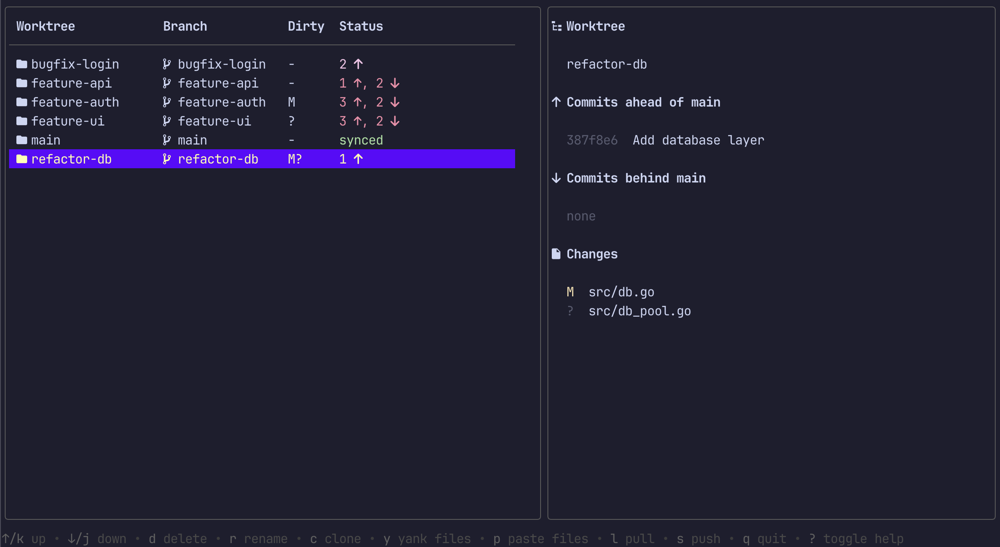

# gx

A collection of git helper (worktree management, etc...)

## Disclaimer

I wrote the original version of the tool in Typescript a while ago but at some
point I realized I wanted something a bit different and had Claude Code migrate it
to Go with a lot of UI changes (see [convert-to-go.md](./docs/prompts/convert-to-go.md)
and [go-migration-plan.md](/docs/go-migration-plan.md)).

## Features

- Browse all linked worktrees in a table with sync status (ahead / behind / diverged)
- Sidebar showing commits ahead/behind the remote tracking branch and uncommitted file changes
- Create, rename, clone, and delete worktrees interactively
- Yank files from one worktree and paste them into another
- Pull, push, and remote-update the selected worktree's branch
- `gx clone-wt` clones using the `.bare` directory trick for a clean layout
- `gx doctor` checks for and optionally fixes common configuration issues
- Startup check for misconfigured fetch refspec with an option to fix automatically
- Scrollable error modal for any git failures
- See [Changelog](./CHANGELOG.md)



## Requirements

- Go 1.21+
- Git

## Installation

Using homebrew:

```sh
brew tap elentok/stuff
brew install --cask gx
```

Using `go install`:

```sh
go install github.com/elentok/gx@latest
```

```sh
make install
```

## Usage

Run from inside any git repository or bare repo:

```sh
gx
```

If launched from inside a worktree, the cursor starts on that worktree.

You can also run the TUI explicitly:

```sh
gx worktrees
gx wt
```

Clone using the `.bare` directory trick and bootstrap the initial worktree:

```sh
gx clone-wt <repo-url> [directory]
```

This creates:

```
my-repo/
  .bare/      ← bare git repo
  .git         ← gitdir: ./.bare
  main/        ← initial worktree
```

Push current worktree branch, with styled force-with-lease confirmation on rejection:

```sh
gx push
```

Create an initial config file with defaults:

```sh
gx init
```

Edit config in `$EDITOR`:

```sh
gx edit-config
```

Check the repo for common configuration issues:

```sh
gx doctor
gx doctor --fix   # interactively apply fixes
```

Print the current binary version:

```sh
gx version
```

## Configuration

Optional config file:

```sh
~/.config/gx/config.json
```

Example:

```json
{
  "use-nerdfont-icons": true
}
```

## Key bindings

| Key            | Action                                             |
| -------------- | -------------------------------------------------- |
| `j` / `↓`      | Move down                                          |
| `k` / `↑`      | Move up                                            |
| `d`            | Delete selected worktree (and its branch)          |
| `r`            | Rename selected worktree and branch                |
| `c`            | Clone selected worktree (copies uncommitted files) |
| `y`            | Yank files from selected worktree into clipboard   |
| `p`            | Pull selected worktree's branch                    |
| `P`            | Push selected worktree's branch                    |
| `t`            | Track remote branch (set upstream)                 |
| `R`            | Refresh worktree list and statuses                 |
| `U`            | Run `git remote update` and refresh                |
| `?`            | Toggle full help                                   |
| `q` / `Ctrl+C` | Quit                                               |

### Paste mode (after `y` + confirm)

| Key       | Action                              |
| --------- | ----------------------------------- |
| `j` / `↓` | Move down                           |
| `k` / `↑` | Move up                             |
| `p`       | Paste yanked files into selected worktree |
| `esc`     | Cancel and clear clipboard          |

## Development

```sh
make test   # run all tests
make run    # run without building
```
